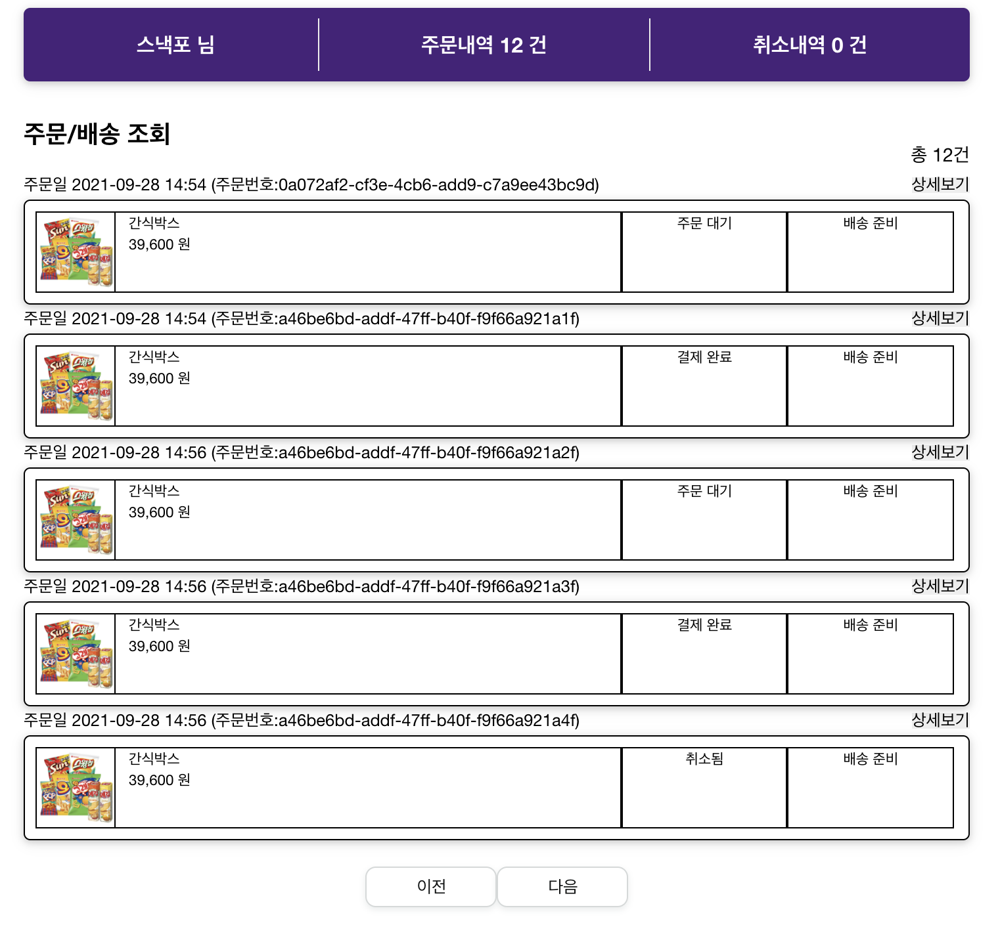

<h1 align="center">
  Snackfor Viewer
</h1>

<p align="center">
  
  
  <a href="https://nostalgic-ramanujan-6d36d9.netlify.app" title="Netlify-deploy-status">
    
  </a>
</p>

<br/>

## Index

  <ol>
    <li><a href="#tech-stack">Tech Stack</a></li>
    <li><a href="#convention">Convention</a></li>
    <li><a href="#features">Features</a></li>
    <li><a href="#ui-example">UI example</a></li>
    <li><a href="#demo">Demo</a></li>
    <li><a href="#installation">Installation</a></li>
  </ol>

<br/>
<br/>

## Tech Stack

Base  
`react, typescript`

Style  
`styled-component`

Caching  
`react-query`

Convention Management  
`eslint`

Version Management  
`git`

<br/>
<br/>

## Convention

- Coding convetions: [google](https://google.github.io/styleguide/jsguide.html)
- [Commit message](https://github.com/helderburato/dotfiles/blob/main/git/.gittemplates/commit)

<br/>
<br/>

## Features

- 운전자는 장소를 검색하여 카풀 생성
- 탑승자는 입력한 장소를 기반으로 근거리 카풀 검색 가능
- 운전자와 탑승자는 실시간 채팅으로 의사소통

<br/>
<br/>

## UI example



<br/>
<br/>

## Demo

[Demo Link](https://nostalgic-ramanujan-6d36d9.netlify.app)

- Netlify를 이용하여 애플리케이션 배포 및 관리

<br/>
<br/>

## Installation

- 로컬에서 구동을 원하시는 경우 아래와 같이 `.env` 파일 설정이 필요합니다.

### env 설정

```shell
REACT_APP_TEST_USER_EMAIL=<Your test email>
```

### Install dependencies

```
npm install
```

### Development

```
npm start
# Visit <http://localhost:3000> from your browser (Chrome)
```
